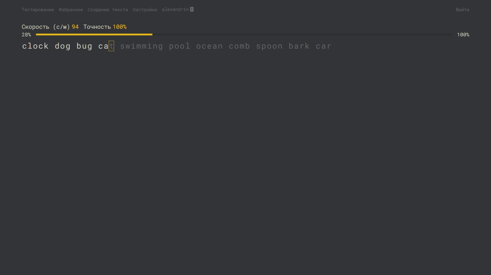
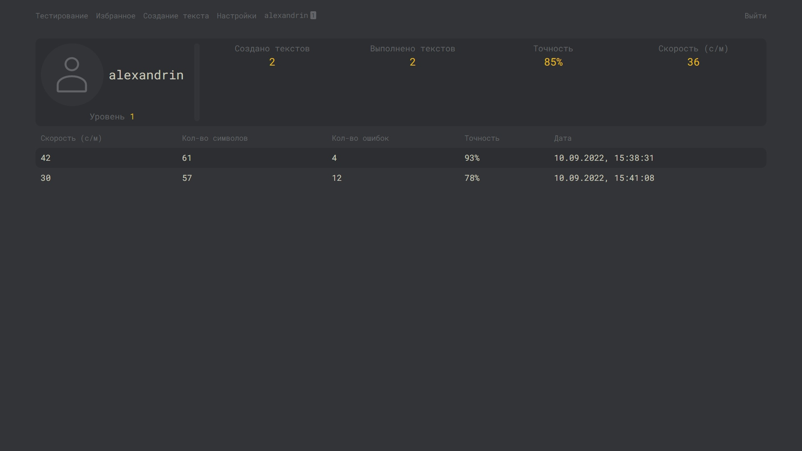
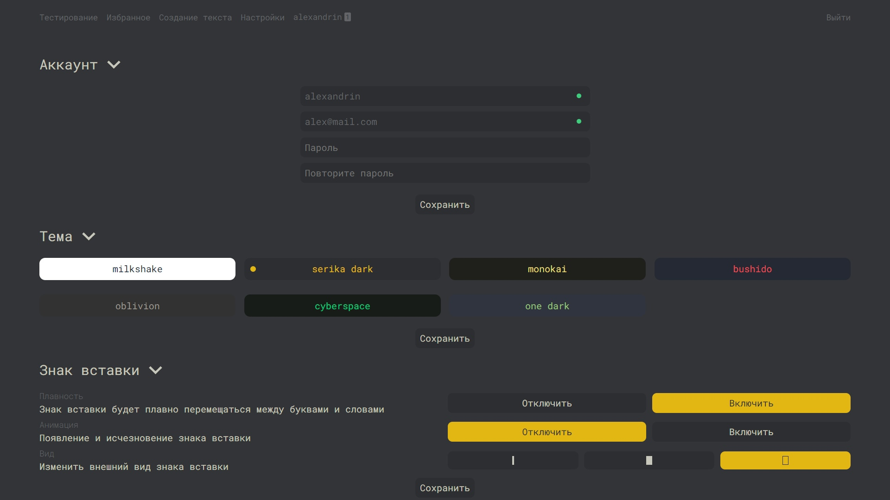

# speekey

This app will help you train and test your typing speed. As a design, I chose the project [Monkeytype](https://monkeytype.com/)

## Authorization page


## Testing page


## Profile page


## Create text page


## Settings page


## Build Setup

```bash
# install dependencies
$ npm install

# serve with hot reload at localhost:3000
$ npm run dev

# build for production and launch server
$ npm run build
$ npm run start

# generate static project
$ npm run generate
```
